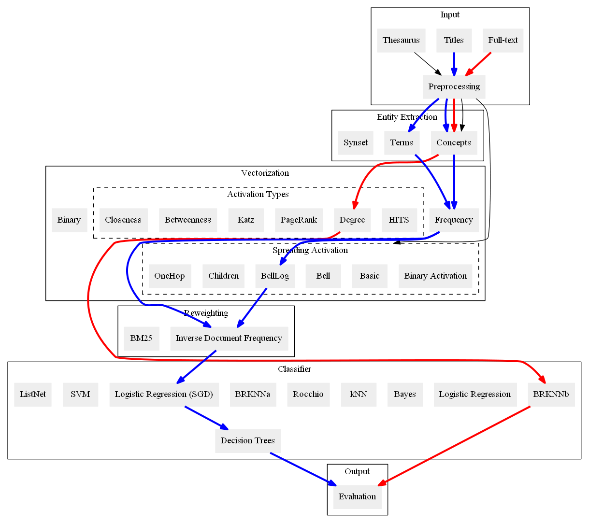

# Quadflor



## Multi-label classification

The multi-label classification task consists of assigning a set of class labels
to a sample of subjects. In the context of scientific or news documents, the
task is equivalent to subject indexing. Using machine learning, the goal is to
generalize from a training set of labeled documents to unlabeled documents.

## A text classification pipeline

[Quadflor](https://github.com/quadflor/Quadflor) is a text-processing pipeline
for multi-label classification of documents and its evaluation. Given
a domain-specific thesaurus with descriptor labels, the different algorithms
learn how to assign these labels to documents from a training set. The
framework supports opportunities to conduct concept extraction, synonym set
resolution, spreading activation including hierarchical re-weighting. The
further processing of these features is performed by a classifier. As built-in
classifier options, Quadflor provides:

- Naive Bayes (two variants)
- Logistic Regression 
- Linear Support Vector Machine
- K-Nearest Neighbors (two multi-label adaption variants, as well as Rocchio),
- Stochastic Gradient Descent
- Stacked Decision Tree Classifier 
- Learning2Rank
- Multilayer Perceptron (MLP)

While the text-processing pipeline is designed for automatic
evaluation of novel classification strategies, it can also be employed in
a practical setting using all known documents as training data and classifying
new, unknown documents.

## Experimental results

In our [experiments](http://arxiv.org/abs/1705.05311), we compared several configurations of
classification techniques using either the full-text or only the titles of the
documents as input. We found that stochastic gradient descent (SGD) optimizing
logistic loss yields reasonably good classification results with respect to
the training time. SGD attained .485 sample-averaged F1 score on the full-text, .429 on the titles
of our economics data set. When more training time can be afforded, decision
trees on top of the SGD classifier could even raise the performance: .498 on
full-text, .451 on titles. Finally, the Multilayer Perceptron requires the
most training time and leads to the best results: .519 on full-text, .472 on
titles.


## Installation

Install Python 3.4 or higher and

```sh
#install necessary packages
sudo apt-get install libatlas-base-dev gfortran python3.4-dev python3.4-venv build-essential

#install python modules in a virtual environment with pip (this may take a while):
python3 -m venv lucid_ml_environment
source lucid_ml_environment/bin/activate
cd Code
pip install -r requirements.txt
```

## Example Usage

An example call with tf-idf features and stochastic gradient descent classifier:

```sh
cd Code/lucid_ml
python3 run.py -tf sgd -k file_paths.json -K example-titles -x
```

where `file_paths.json` should contain the key given by `-K` specifying the
paths to data (`X`), the gold standard (`y`), and the thesaurus (`thes`).

-x means a single pass of training will be run and results reported. 
-X could be used for full cross validation.

## Example Usage 2

```
python3 run.py -v -tf sgd -F -k sample_paths.json -K sample-fulltext -x -p --persist_to /example/directory
```
Enhances the first example by verbose output, -v, full text classification, -F, and persistance of features to more quickly load them.


